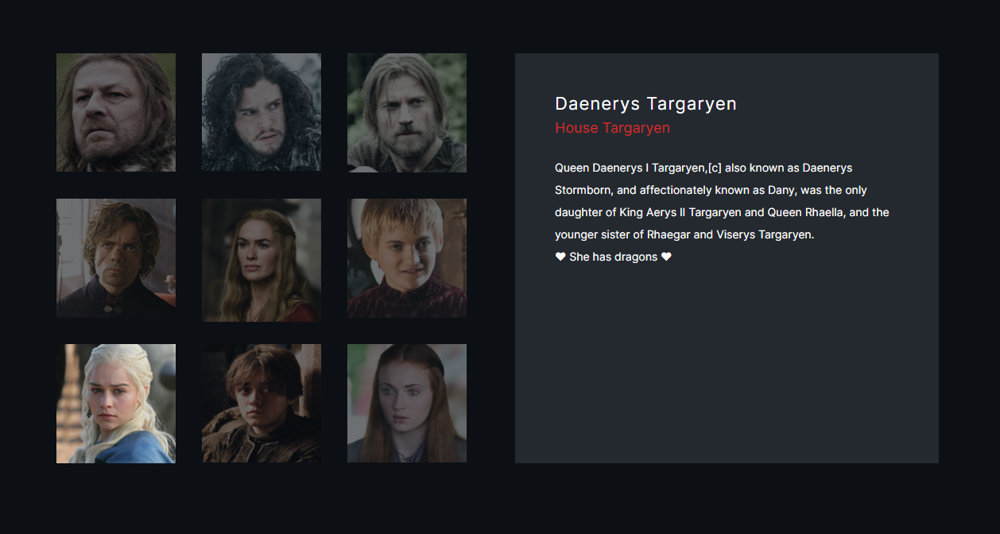

# Game of Thrones Swiper

A Swiper exercise done during my training at [BeCode](https://becode.org/all-trainings/pedagogical-framework-junior-developer/).

## The Goal

Using the Swiper library to display informations about GoT characters when we click on their picture.

## What does it look like ?

Check the result ➡️ [here](https://dystrima.github.io/Swiper/) ⬅️

